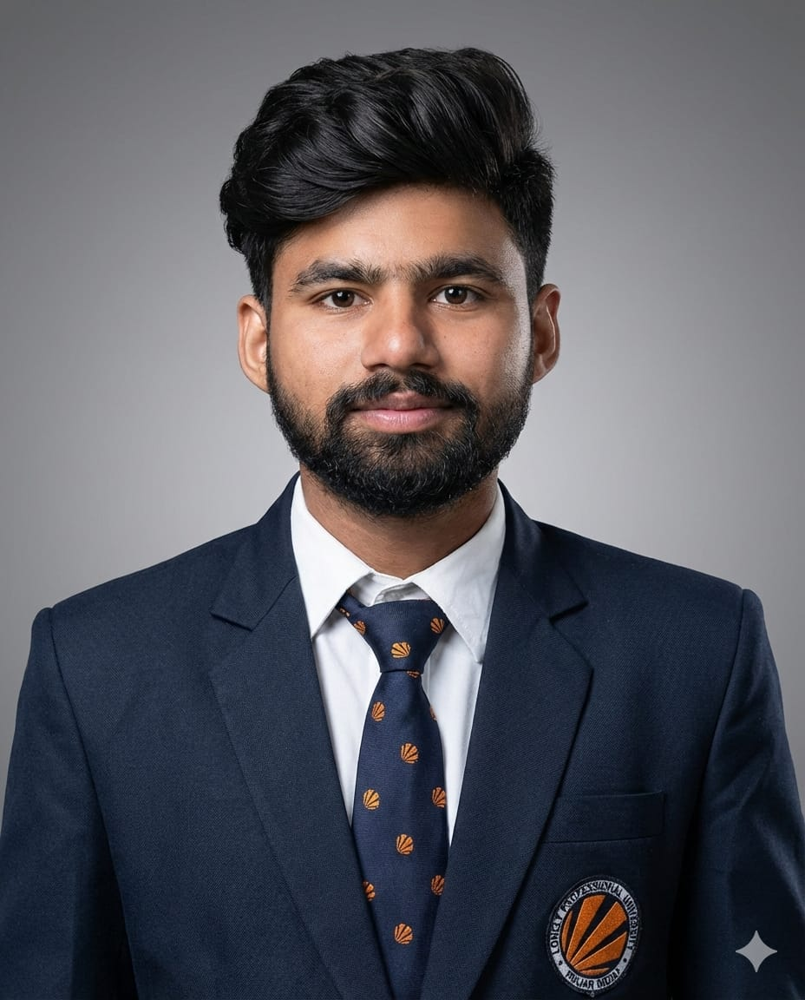

# Satyam Naidu

📧 Naveenkumar81447@gmail.com  
🔗 [LinkedIn](http://www.linkedin.com/in/Naveen00)

---

## Professional Summary
Strong background in **data analysis**, **data visualization**, and **statistical modeling**. Skilled in data manipulation and cleaning, with hands-on experience using **Python**, **SQL**, and business intelligence tools to derive actionable insights.

---

## Technical Skills
- **Programming Languages:** Python, C++
- **Data Visualization:** Power BI, Tableau, MS Excel
- **Data Management:** MySQL
- **Libraries & Tools:** Pandas, NumPy

---

## Education
**B.Tech in Computer Science**  
Lovely Professional University, Phagwara, India  
*Jun 2020 – Present*  
**CGPA:** 7.46

**Intermediate (MPC)**  
Sri Prakash Vidya Niketan College, Tuni, India  
*Jun 2018 – Mar 2020*  
**CGPA:** 8.3

---

## Training
**Python Programming Training**  
Techvanto Academy, New Delhi, India  
*May 2022 – July 2022*
- Gained hands-on experience in developing Python-based projects
- Worked extensively with Pandas and NumPy for data analysis
- Practiced weekly assignments focused on real-world problem solving

---

## Projects
### Sales Insights Project *(Apr 2023)*
**Domain:** Data Analysis  
**Tools:** Power BI
- Designed an interactive dashboard to analyze regional sales performance
- Tracked revenue metrics, sales quantity, and regional revenue breakdown
- Enabled data-driven decision-making that contributed to improved sales insights

### HR Data Analytics Project *(Apr 2023)*
**Domain:** Data Analysis  
**Tools:** Power BI
- Analyzed real-world HR datasets related to workforce distribution
- Built dashboards to visualize employee metrics
- Gained understanding of HR analytics and business requirements

---

## Certifications
- **R Programming** – Johns Hopkins University (Coursera), Apr 2023
- **Data Visualization with Tableau** – Coursera, Mar 2023
- **Create Charts and Dashboards using MS Excel** – Coursera, Oct 2022

---

## Achievements
- **1st Place**, Winter PEP Exams – Analytical Problem-Solving Competition *(Nov 2021 – Jan 2022)*

---

## Leadership & Activities
- Organized workshops on analytical reasoning in college
- Participated in **Under-17 Kabaddi Competition** organized by the state government

---

## Personal Skills
- Team Player
- Creative Thinker
- Problem Solver
- Highly Focused

---

*Note: Please ensure `headshot.jpg` is uploaded to the same repository as this Resume.md file.*

